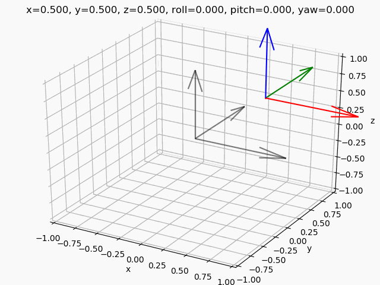

# Spatial Transform

Playing around with rotations and quaternions. Also, trying out [pytest](https://docs.pytest.org/en/latest/contents.html). Euler angles used are in ZYX intrinsic order.

## Unit Testing

Run `python -m pytest` to run unit tests

## References

* https://en.wikipedia.org/wiki/Slerp
* https://robotacademy.net.au/lesson/rotation-angle-sequences-in-3d/
* https://www.euclideanspace.com/
* https://en.wikipedia.org/wiki/Rotation_formalisms_in_three_dimensions
* https://en.wikipedia.org/wiki/Euler_angles
* https://www.andre-gaschler.com/rotationconverter/
* [Dual Quaternion](http://wscg.zcu.cz/wscg2012/short/A29-full.pdf)